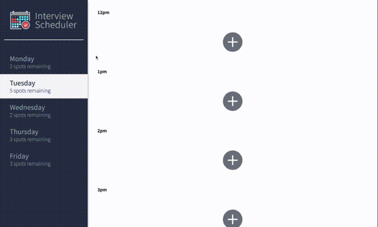

# Interview Scheduler
Interview Scheduler is a React application that allows users to book and cancel interviews.

## Final Product


## Dependencies
- babel
- React
- axios
- classnames
- normalize

## Development dependencies
- Storybook
- Testing library
- node-sass
- prop-types
- react-test-renderer

## Setup

Install dependencies with `npm install`.

## Running Webpack Development Server

```sh
npm start
```

## Running Jest Test Framework

```sh
npm test
```

## Running Storybook Visual Testbed

```sh
npm run storybook
```
